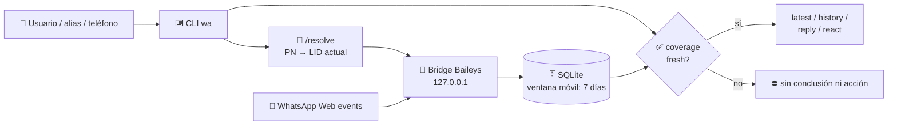

# 💬 WhatsApp Assistant

> Un bridge local de WhatsApp con Baileys y un CLI pensado para consultar el
> contexto **reciente y correcto** de una conversación.

WhatsApp Assistant mantiene un mirror privado de los últimos siete días y
expone un comando `wa` para leer, buscar, descargar adjuntos y —únicamente
cuando se pide en forma explícita— enviar, responder o reaccionar. No es una
integración oficial de WhatsApp y nunca abre una API a Internet.


## ✨ Qué resuelve

| | |
| --- | --- |
| 🔄 **Contexto reciente** | El bridge recibe eventos mientras está conectado y conserva sólo una ventana móvil de siete días. |
| 🎯 **Chat correcto** | Resuelve el número telefónico histórico al LID actual de WhatsApp antes de leer o actuar. |
| ✅ **Acciones seguras** | `latest`, reacciones y replies verifican cobertura `fresh`, para no operar sobre un mensaje viejo. |
| 🔒 **Local y privado** | API limitada a `127.0.0.1`; credenciales, cache y aliases nunca entran a Git. |
| 🧠 **Sin heurísticas de idioma** | El CLI presenta hechos; interpretar intención, urgencia o pendientes es trabajo de la IA. |

## 🚀 Instalación rápida

### 🍺 macOS con Homebrew (recomendada)

```bash
brew tap diegomarvid/tap
brew install whatsapp-assistant
wa setup
```

`wa setup` instala y arranca un LaunchAgent local, y abre la imagen QR sólo si
la cuenta todavía no está vinculada. Después del vínculo inicial, el servicio
se reconecta automáticamente al iniciar sesión en macOS.

Si ya usabas el checkout de este repositorio, migrá primero el estado privado
para conservar la sesión y el mirror sin escanear otro QR:

```bash
wa migrate-state ~/Documents/whatsapp-assistant
wa setup
```

El estado instalado queda en `~/Library/Application Support/WhatsApp Assistant/`:
ahí viven `auth/`, SQLite, aliases, token y logs. Homebrew puede actualizar o
desinstalar el código sin borrar conversaciones recientes ni credenciales.

### Requisitos base

- Node.js **22 o superior**.
- Una cuenta de WhatsApp para vincular una sola vez por QR.
- macOS si se quiere usar el LaunchAgent y la búsqueda opcional en Contactos.

```bash
git clone https://github.com/diegomarvid/whatsapp-assistant.git
cd whatsapp-assistant
npm install
npm link
npm start
```

En el primer arranque aparece un QR. En WhatsApp móvil: **Ajustes →
Dispositivos vinculados → Vincular un dispositivo**. Escanealo una sola vez.
Después, conservar `auth/` permite reconectar tras reiniciar la Mac sin volver a
escanear.

En un checkout de desarrollo, el estado se conserva en `auth/` y `data/` del
proyecto para compatibilidad. En la instalación Homebrew queda fuera del
paquete. En ambos casos, el token, las credenciales y el mirror privado están
excluidos de Git.

> [!IMPORTANT]
> Antes de tocar una sesión, pedir un QR o modificar sincronización, leer
> [`docs/onboarding-and-recovery.md`](docs/onboarding-and-recovery.md). El modo
> normal es **sync reciente**, no un archivo histórico completo.

### 🎧 Transcripción de audios (opcional)

El bridge funciona sin Whisper. Sólo `wa transcribe` requiere una instalación
adicional: delega en [`ct transcribe`](https://github.com/diegomarvid/claude-tools).

- En Apple Silicon, `ct` usa `mlx_whisper` con `whisper-large-v3-turbo`.
- En otros entornos puede usar `whisper-ctranslate2` o el fallback Python con
  `faster-whisper`.
- Verificá la dependencia antes de usar la transcripción:

  ```bash
  command -v ct
  ct transcribe --help
  ```

Por ahora `ct` es una dependencia externa: no se instala automáticamente con
`npm install`. Si el proyecto se publica como paquete, conviene decidir si la
transcripción sigue siendo un _optional peer dependency_ o se ofrece como un
adaptador instalable aparte.

## 🧭 Uso diario

```bash
wa status
wa find "Florencia"
wa latest-incoming Florencia --ids
wa history Florencia 20 --ids
```

Guardá una relación estable entre un nombre y un teléfono como alias privado:

```bash
wa alias add flor +598XXXXXXXX "Florencia Ferrario"
wa latest-incoming flor
```

Los aliases viven en `data/aliases.json`, fuera de Git. `wa find` también puede
usar nombres sincronizados por WhatsApp, mensajes recientes y, en macOS,
Contactos como complemento. No copia la agenda al mirror.

## ⌨️ Comandos

### Consultar chats y cobertura

| Comando | Para qué sirve |
| --- | --- |
| `wa status` | Estado del bridge y cantidad de mensajes cacheados. |
| `wa find "Nombre"` | Busca aliases, identidad WhatsApp, mensajes recientes y Contactos de macOS opcionales. |
| `wa recent 20` | Chats individuales recientes con identidad WhatsApp. |
| `wa latest contacto` | Último evento del chat, entrante o saliente. |
| `wa latest-incoming contacto` | Último mensaje **recibido** de ese contacto. |
| `wa history contacto 20 --ids` | Últimos mensajes, con IDs para descargar, responder o reaccionar. |
| `wa coverage contacto` | Indica si el chat está sincronizado (`fresh`) o si hay un hueco verificable. |
| `wa search contacto "presupuesto"` | Busca texto dentro de un chat. |
| `wa search-all "Oracle" --since 7d` | Busca texto en todos los chats recientes. |
| `wa pending --since 24h` | Hecho estructural: chats directos cuyo último evento fue entrante. |

> `latest` incluye tus propios mensajes; para “¿qué me mandó X?”, usar siempre
> `latest-incoming`. Ambos exigen cobertura reciente antes de responder.

### 👥 Grupos de trabajo

| Comando | Para qué sirve |
| --- | --- |
| `wa groups find maspeak` | Muestra grupos ya confirmados y propone candidatos recientes. |
| `wa groups inspect <jid>` | Lee título, descripción y mensajes recientes antes de clasificar. |
| `wa groups add maspeak <jid>` | Guarda un grupo confirmado en la lista privada. |
| `wa pending --groups maspeak --since 24h` | Actividad cuyo último intercambio fue entrante en esos grupos. |
| `wa coverage <grupo-jid>` | Verifica cobertura de un grupo usando su JID `…@g.us`. |

La lista está en `data/group-lists.json`, no en el código ni en Git. `find`
siempre vuelve a revisar los grupos actuales para poder descubrir nuevos.

### 📎 Audio, imágenes y archivos

| Comando | Para qué sirve |
| --- | --- |
| `wa audios contacto` | Lista audios recientes y si su envelope está disponible. |
| `wa audio contacto <message-id>` | Descarga un audio seleccionado. |
| `wa transcribe contacto latest` | Descarga el audio más reciente y lo transcribe con `ct`/Whisper. |
| `wa transcribe contacto <message-id>` | Transcribe un audio concreto; el ID sale de `wa audios` o `wa history --ids`. |
| `wa images contacto` / `wa image contacto <message-id>` | Lista o descarga una imagen seleccionada. |
| `wa image-text contacto <message-id>` | Hace OCR local con Vision de macOS. |
| `wa files contacto` / `wa file contacto <message-id>` | Lista o descarga un documento entrante seleccionado. |

El comando de transcripción correcto es `wa transcribe contacto latest` o
`wa transcribe contacto <message-id>`: no recibe un selector genérico
`<id|latest>` en la tabla porque el ID tiene que corresponder a un audio.

### ✉️ Acciones explícitas

| Comando | Para qué sirve |
| --- | --- |
| `wa react contacto latest-incoming 👍` | Reacciona al último mensaje entrante confirmado. |
| `wa reply contacto latest-incoming "Entendido"` | Responde citando un mensaje concreto. |
| `wa send contacto "mensaje"` | Envía un texto. |
| `wa send-file contacto /ruta/resumen.pdf "mensaje"` | Envía un archivo como documento. |

El bridge nunca envía, reacciona ni responde por su cuenta. `send`, `send-file`,
`react` y `reply` requieren un comando explícito; las operaciones que usan
`latest` sólo se ejecutan si el mismo chat tiene cobertura `fresh`.

## 🏗️ Cómo se mantiene actualizado

WhatsApp puede representar el mismo contacto con un número telefónico (PN,
`…@s.whatsapp.net`) o un identificador privado de cuenta (LID, `…@lid`). Los
mensajes nuevos pueden llegar bajo el LID aunque un alias viejo señale al PN.

1. El observer de Baileys recibe eventos en tiempo real y persiste el batch en
   SQLite antes de que el CLI lo consulte.
2. Cuando se consulta un contacto directo, el CLI pide `/resolve`: el bridge
   traduce PN → LID actual usando el mapping de Baileys.
3. `coverage` comprueba conexión, salud del observer y cursor. Si no está
   `fresh`, el CLI no inventa un “último mensaje” ni actúa sobre uno viejo.
4. Una acción usa el JID y el message ID que salieron de esa misma lectura
   confirmada.



Los grupos mantienen su JID `…@g.us` y no se remapean como contactos.

## 🔐 Privacidad y límites

- La API escucha solamente en `127.0.0.1`; todas las rutas salvo `/health`
  requieren el token local.
- El mirror conserva como máximo **siete días** y 10.000 mensajes: no es un
  backup ni pretende pedir el historial completo.
- También guarda envelopes raw recientes para reintentos de Baileys, media
  seleccionada y un audit técnico sin texto. Nada se sube.
- El CLI no intenta detectar saludos, urgencia, intención ni “pendientes” por
  regex o palabras clave. La IA interpreta el contenido después de leer los
  hechos estructurales.

Para el detalle de qué estado es privado y queda excluido de Git, ver
[`docs/private-state.md`](docs/private-state.md).

## 🩺 Operación y recuperación

- `wa daemon status` muestra el servicio; `wa daemon restart` lo reinicia sin
  desvincular WhatsApp. `wa daemon uninstall` elimina sólo el servicio y deja
  intacto el estado privado.
- `wa setup` instala el LaunchAgent en macOS y abre el QR como imagen, no como
  una pestaña de navegador.
- Dejá el proceso/LaunchAgent corriendo para recibir los eventos nuevos.
- Si algo parece viejo, usar primero `wa status`, `wa coverage contacto` y
  `wa latest-incoming contacto`.
- Un reinicio normal con las credenciales existentes **no necesita QR**.
- Pedir o resetear la sesión es el último recurso: seguí el checklist completo
  en [`docs/onboarding-and-recovery.md`](docs/onboarding-and-recovery.md).

## 🔌 API local

Todas las rutas, salvo `GET /health`, requieren:

```text
Authorization: Bearer <contenido de data/bridge-token>
```

| Ruta | Uso |
| --- | --- |
| `GET /health` | Estado de conexión, sin token. |
| `GET /snapshot` | Vista reciente consistente del mirror. |
| `GET /resolve?jid=<jid>` | Resuelve un PN al LID vivo conocido por Baileys. |
| `GET /chats?limit=50` | Chats conocidos, más recientes primero. |
| `GET /messages?jid=<jid>&limit=50` | Mensajes sincronizados de un chat. |
| `GET /search?q=<texto>&limit=30` | Búsqueda local en mensajes recientes. |

---

Hecho para ser un asistente de contexto reciente: **local, verificable y sin
convertirse en un archivo de toda la cuenta**.
