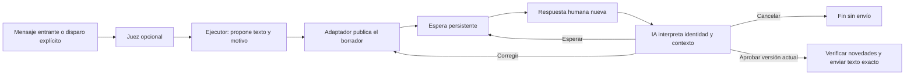

# Borradores con revisión humana

Este es un patrón general para cualquier automatización: preparar un mensaje,
presentarlo con contexto, interpretar feedback humano, corregir o cancelar, y
enviar únicamente la versión aprobada. No implementa una campaña ni una
integración de negocio específica.

El disparador, el criterio de atención, la revisión y el envío son piezas
separadas. Una regla puede contestar directamente o exigir revisión. El juez
opcional sigue decidiendo si corresponde intervenir; el intérprete de revisión
decide qué pidió la persona que respondió al borrador.



## Qué está implementado

- Política de revisión opcional por regla, guardada en el estado privado.
- Publicación con nombre de automatización, responsable, destinatario, motivo,
  versión y texto propuesto. El contexto de revisión no se envía a WhatsApp.
- Respuestas literales, identidad estable, respuestas encadenadas, historial de
  versiones y ediciones. No hay regex para interpretar «sí», «no» o intención.
- Lista explícita de revisores autorizados. Bots, autores desconocidos y mensajes
  en nombre de un canal no pueden aprobar ni despiertan al intérprete.
- Espera, corrección, cancelación, vencimiento y máximo de versiones configurables.
- Aprobación ligada al texto y destinatario exactos. El intérprete no dispone
  de envío directo ni workspace; la entrega la hace el motor con esa propuesta.
- Adaptador opcional para el CLI Maspeak/Mustpeak Drafts. El núcleo no requiere
  ese CLI, un bot específico, Telegram ni credenciales de Maspeak.
- Disparo explícito con clave idempotente para un scheduler, una automatización
  de Codex, otro CLI o una integración externa. No crea horarios por sí mismo.

## Configurar una regla

Crear primero los perfiles del ejecutor y del intérprete usando
`wa agents profile set`. Como base para el intérprete está
[`prompts/draft-reviewer.md`](prompts/draft-reviewer.md). Su perfil no debe tener
workspace. El prompt del ejecutor define el propósito de la automatización, los
datos que puede consultar y las acciones autorizadas; la revisión de borradores
autoriza la comunicación, no amplía permisos para modificar sistemas.

Guardar fuera del repositorio una política JSON completa, por ejemplo
`/ruta/privada/review-policy.json`:

```json
{
  "version": 1,
  "adapter": {
    "command": ["/ruta/absoluta/al/adaptador", "argumento-fijo"],
    "cwd": "/ruta/de/trabajo"
  },
  "profile": "reviewer",
  "actor": "Responsable de esta automatización",
  "instructions": "Cualquier revisor autorizado puede aprobar. Considerá todas las respuestas actuales; ante contradicciones o condiciones pendientes, pedí una versión nueva o esperá. Nunca supongas aprobación por silencio.",
  "reviewers": ["canal:identidad-estable"],
  "pollSeconds": 30,
  "expiresSeconds": 604800,
  "maxRevisions": 5
}
```

El adaptador es un programa de confianza configurado por el operador. Se ejecuta
sin shell, con argumentos separados, timeout de 35 segundos y salida limitada.
`pollSeconds` admite 5–3600; `expiresSeconds`, 60–2592000; `maxRevisions`, 1–20.
Cada publicación tiene una clave estable. El plazo cuenta desde la primera
propuesta y no se reinicia al corregirla.

```sh
wa automation review-policy check /ruta/privada/review-policy.json
wa automation review-policy status /ruta/privada/review-policy.json

# Revisión de respuestas a mensajes entrantes; arranca en observación.
wa automation prompt add conversacion-revisada \
  --from contacto --to contacto --profile ejecutor \
  --review-policy /ruta/privada/review-policy.json --mode observe --yes

# Regla invocable por cualquier scheduler o integración; no se dispara sola
# al recibir mensajes. El modo live autoriza publicar propuestas externas.
wa automation prompt add trabajo-revisado \
  --from contacto --to contacto --profile ejecutor \
  --trigger manual --review-policy /ruta/privada/review-policy.json \
  --mode live --paused --yes

wa automation prompt show trabajo-revisado --json
wa automation prompt resume trabajo-revisado
wa automation prompt trigger trabajo-revisado \
  --key operacion-estable-123 --reason "Contexto del trabajo autorizado"
```

La clave identifica una operación lógica, no un intento. Repetir clave y motivo
devuelve el mismo trabajo; cambiar el motivo con la misma clave falla. No se
acepta otro disparo de esa regla mientras tenga trabajo pendiente o incierto.
Las claves de disparos explícitos sobreviven al período de retención del espejo.
La política se copia al crear la regla; editar el archivo original no modifica
aprobaciones o reglas ya creadas. Para otra política, crear una regla nueva y
retirar la anterior, conservando el historial.

## Contrato para cualquier adaptador

Un proceso por operación. Recibe un JSON por stdin y devuelve un único JSON por
stdout. No puede clasificar aprobaciones ni enviar a WhatsApp. El wrapper puede
hablar con cualquier API, socket o CLI que conserve identidad, orden e
idempotencia. Errores salen con código distinto de cero; no imprimir secretos.

### Publicar o revisar

```json
{
  "version": 1,
  "op": "publish",
  "draft": {
    "key": "wa-batch-id-r2",
    "parentId": "draft-anterior-o-null",
    "revision": 2,
    "target": {"jid": "destino@g.us", "label": "Destinatario"},
    "text": "Texto exacto para WhatsApp",
    "context": {"automation": "nombre-regla", "actor": "Responsable", "reason": "Por qué se propone este mensaje"}
  }
}
```

```json
{"status":"published","id":"draft-id","messageId":"mensaje-del-canal"}
```

`parentId` es `null` para la primera versión. Conservar el vínculo entre versiones
y mostrar claramente cuál debe responder el revisor. Una clave repetida debe
devolver el mismo draft; nunca publicar dos veces. Ante entrega ambigua, devolver
`{"status":"delivery_unknown","id":"id-si-se-conoce"}`. El motor bloquea esa
propuesta y conserva su clave para inspección; no inventa otra clave para reintentar.
El texto propuesto admite hasta 2000 caracteres y su motivo hasta 600.

### Leer respuestas

```json
{"version":1,"op":"replies","draftId":"draft-id","after":12}
```

```json
{
  "replies": [{
    "id":"13", "cursor":13, "draftId":"draft-id", "messageId":"mensaje-humano",
    "author":{"id":"canal:identidad-estable", "label":"Nombre visible", "isBot":false},
    "senderChat":null, "text":"Opinión literal", "edited":false,
    "audio":null, "transcript":null
  }],
  "nextCursor":13
}
```

Máximo 50 eventos por página, cursores enteros seguros y estrictamente crecientes.
`nextCursor` es el último evento devuelto, o `after` si no hay respuestas. El
motor drena páginas antes de interpretar o enviar; no omitir eventos para
avanzar el cursor. Cada edición genera otro evento con el mismo `messageId` y
un nuevo `id`/`cursor`; el intérprete recibe su última versión. El adaptador debe
vincular las respuestas encadenadas al draft original.

`author.id` identifica a la persona en el proveedor, no su nombre visible.
`senderChat` debe informarse si responde un canal o administrador anónimo.
`audio` señala contenido que requiere escucha/transcripción; opcionalmente el
adaptador agrega `transcript` con el texto completo. Sin transcripción, no se
permite aprobar el feedback nuevo que contiene audio. El intérprete puede esperar
una reformulación en texto o pedirla en el motivo de una nueva propuesta.

La recepción persiste eventos y cursor antes de despertar al modelo. La decisión
persiste separadamente `processedCursor` junto con su acción; un fallo del modelo
no consume feedback que todavía no procesó. Leer no consume respuestas de otras
automatizaciones. Cada versión tiene su propio cursor. Respuestas a versiones
anteriores permanecen en el servicio, pero no autorizan ni cancelan la actual:
el revisor debe responder a la última propuesta.

Límite por versión: 2000 eventos/256000 caracteres serializados. Al excederlo o
recibir un protocolo inválido se conserva el cursor previo, no se envía y se
registra el error para inspección. `status` es una operación de diagnóstico
opcional: `{"version":1,"op":"status"}` → JSON con salud del servicio.

## Adaptador Maspeak/Mustpeak Drafts

Implementación: [`src/review-adapters/maspeak-drafts.js`](../src/review-adapters/maspeak-drafts.js).
Es una traducción del contrato de su CLI; no distribuye ese servicio, instala
bots ni contiene usuarios, grupos, servidores privados o tokens reales.

Archivo privado `/ruta/privada/maspeak-adapter.json`:

```json
{
  "command": ["/ruta/absoluta/npm", "run", "--silent", "maspeak", "--", "drafts"],
  "cwd": "/ruta/al/repositorio/maspeak"
}
```

Con un wrapper remoto, `command` puede ser
`["/ruta/absoluta/maspeak-remote", "drafts"]`; si el ejecutable ya es
`maspeak-drafts`, no repetir `drafts`. En la política general:

```json
{
  "command": ["/ruta/absoluta/node", "/ruta/whatsapp-assistant/src/review-adapters/maspeak-drafts.js", "/ruta/privada/maspeak-adapter.json"]
}
```

Las identidades se representan como `telegram:ID_NUMERICO`. Configurar los IDs
permitidos en la política privada. El adaptador usa `send`/`revise` con `--key`,
`--actor`, `--target` y contexto; consulta `replies ID --after CURSOR --wait 0`.
No interpreta «sí» o «no»: devuelve texto, identidad y ediciones literales.
Con privacy mode de Telegram, responder directamente al mensaje del bot es el
camino garantizado. Telegram puede no avisar al bot que se borró una respuesta;
para retirar una aprobación, responder o editar explícitamente antes del envío,
sin confiar en que eliminar el mensaje sea una cancelación detectable.

Audio opcional: configurar `transcribeCommand` como array de ejecutable absoluto
y argumentos. Se agrega al final la ruta del audio; ese wrapper debe devolver
`{"text":"transcripción completa"}` por stdout. No invocar directamente un
transcriptor que imprime solamente una ruta. El adaptador descarga el audio a un
directorio temporal privado y lo borra al terminar. No expone tokens, URLs de
autenticación ni identificadores de archivo de Telegram al modelo.

## Herramientas del agente

El ejecutor prepara una sola propuesta y termina:

```sh
wa automation draft submit --text "Mensaje exacto" --reason "Contexto para el revisor"
```

Este comando registra el resultado `awaiting_review`; no llamar después a
`automation result`. No publica en modo observación. Si no corresponde proponer
un mensaje, el ejecutor conserva `automation result no_reply|needs_human|waiting`.

Al llegar feedback autorizado, se ejecuta el perfil de revisión sin workspace:

```sh
wa automation draft context
wa automation draft decide approve --revision 2 --cursor 13 --reply 13 --reason "Aprobación inequívoca de la versión actual"
wa automation draft decide revise --revision 2 --cursor 13 --reply 13 --reason "Cambio solicitado; revisar esta nueva versión" --text "Texto completo corregido"
wa automation draft decide cancel --revision 2 --cursor 13 --reply 13 --reason "Se pidió abandonar el mensaje"
wa automation draft decide wait --revision 2 --cursor 13 --reason "Todavía no hay una decisión suficiente"
```

Se elige una acción, no se ejecuta toda esa secuencia. `approve`, `revise` y
`cancel` requieren evidencia nueva de una identidad autorizada. `wait` reconoce
el feedback actual y duerme hasta nuevas respuestas. Una corrección que supera
`maxRevisions` cancela; el vencimiento también termina sin enviar. El intérprete
considera todas las opiniones actuales según `instructions`; si dos revisores
se contradicen, no hay una regla de «primero gana» codificada por palabras.

## Espera, Codex y operación

El daemon consulta solo borradores pendientes, según `pollSeconds`. No hay
llamadas a IA sin mensajes elegibles o feedback autorizado nuevo. La decisión
es durable: reiniciar no pierde la espera. Antes de entregar se vuelve a consultar
el feed completo desde el cursor, la cobertura de WhatsApp y la identidad del
destinatario. Una edición posterior a ese último chequeo puede llegar después
de iniciado el envío; no existe una transacción atómica entre Telegram y WhatsApp.

Una automatización de Codex puede hacer el trabajo programado o invocar
`automation prompt trigger` con una clave estable por operación. Después termina;
el daemon continúa la revisión, incluso si esa tarea de Codex ya no está activa.
Este componente no crea automaciones de Codex, horarios ni campañas. Para una
ejecución concreta se configuran su propósito, alcance y calendario por separado.

Webhooks son una extensión posible del adaptador para avisar que hay novedades.
Esta versión usa polling liviano del canal de revisión; no tiene un endpoint
público de webhook ni un consumidor propio de Telegram `getUpdates`. Con Maspeak
se reutiliza el consumidor único de su servicio. La latencia incluye intervalo
de consulta y tiempo de interpretación. El daemon y el servicio deben estar
ejecutándose; una Mac dormida no procesa nada.

`wa automation prompt show NOMBRE --json` muestra revisiones, claves, cursores,
decisiones, errores y outbox. `pause`, `human` y cambios de modo invalidan lo
pendiente. Para abandonar una sola operación: `wa automation prompt cancel BATCH --reason "motivo"`; si es incierta, exige registrar primero una revisión factual con `prompt review`. Esto no deshace envíos iniciados. Mensajes nuevos del chat fuente invalidan borradores viejos, también
para disparos explícitos: no se manda un texto aprobado sobre un contexto que
ya cambió. Una regla manual no genera otro trabajo por ese mensaje; el caller
inspecciona y decide cuándo disparar una operación nueva.

Una publicación incierta requiere buscar la clave en el servicio de revisión.
Una entrega WhatsApp incierta requiere revisar su ID reservado en el chat. No
recrear reglas, claves o borradores para sortear esa inspección. La recuperación
incierta es manual; esta versión no tiene un comando que dé por recibida una
publicación externa sin verificación. Los IDs reservados excluyen el eco de la
propia automatización y las entregas respetan el límite horario de la regla.

## Estado, prueba y límites

El estado pasa a schema **v3**, lee v1/v2 y conserva reglas sin revisión. Antes de
instalar o volver a una versión anterior, copiar privadamente
`data/prompt-automations.json` y perfiles. Una versión vieja no entiende v3: no
instalarla sobre estado nuevo sin reconciliar trabajo, decisiones y entregas.
No se modifican la sesión ni el historial de WhatsApp.

El JSON privado contiene textos y feedback de revisión. Pendientes e inciertos
se conservan; terminales de reglas por mensajes usan la retención de siete días.
Los disparos explícitos conservan historial y claves indefinidamente para evitar
duplicados de schedulers. Los audios temporales se eliminan; las transcripciones
forman parte del feedback persistido. No guardar política real, estado, chats o
transcripciones en este repositorio público.

Prueba reproducible sin publicar ni enviar mensajes:

```sh
npm run check
node --test test/automation-reviews.test.js
npm test
```

Cubre contexto, versiones, espera sin IA, identidad, ediciones paginadas,
cancelación, vencimiento, control humano, audio sin transcribir, publicación y
entrega inciertas, reinicio, idempotencia, alcance de herramientas y adaptación
del contrato Maspeak. Para una prueba real, crear una regla de laboratorio y una
política privada apuntando a revisores conocidos; revisar primero en observación,
habilitar `live` y comprobar publicación → respuesta → entrega en el destino.
Las pruebas simuladas no prueban aprobación humana ni recepción real en WhatsApp.

Como en el motor de conversaciones, el permiso del bridge limita sus endpoints;
no constituye aislamiento del sistema operativo. El proveedor CLI corre bajo el
usuario local. No usar un perfil con acceso general a credenciales como si fuera
un contenedor seguro para mensajes no confiables.

### Verificación del 2026-09-06

`npm run check` y 203 pruebas del repositorio pasan, incluidas 24 pruebas del
flujo de revisión y su adaptador, más el contrato de comandos del CLI. El paquete
incluye el código y la guía del adaptador, sin estado privado. Se verificó el
adaptador Maspeak con una consulta real de salud: servicio conectado, modo de
respuestas activo, sin ejecución de WhatsApp por parte de ese servicio.

La publicación y entrega de extremo a extremo están probadas con transportes
simulados; queda la prueba humana real al configurar una política de laboratorio.

### Despliegue del 2026-09-06

Integrado en `main` y PR #1 fusionada. La versión `0.10.0` quedó instalada en el
daemon local: sesión existente, conexión abierta, ingestión saludable y cobertura
fresca del grupo de laboratorio. Se verificó el código instalado contra la versión
etiquetada. La migración a schema v3 conservó los perfiles y estados de las reglas
existentes, sin nuevos trabajos inciertos; se guardó backup privado previo.
Este despliegue no configura una integración de negocio ni una regla nueva de drafts.

La [release v0.10.0](https://github.com/diegomarvid/whatsapp-assistant/releases/tag/v0.10.0)
incluye el paquete instalable. GitHub CI pasó las 203 pruebas. La publicación
automática en npm fue rechazada por el registro (HTTP 404); npm seguía ofreciendo
`0.9.7` al verificar. Hasta resolver el acceso de publicación, instalar el archivo
de la release según sus instrucciones. Este pendiente de distribución no impide
que el daemon local ejecute la versión nueva.
