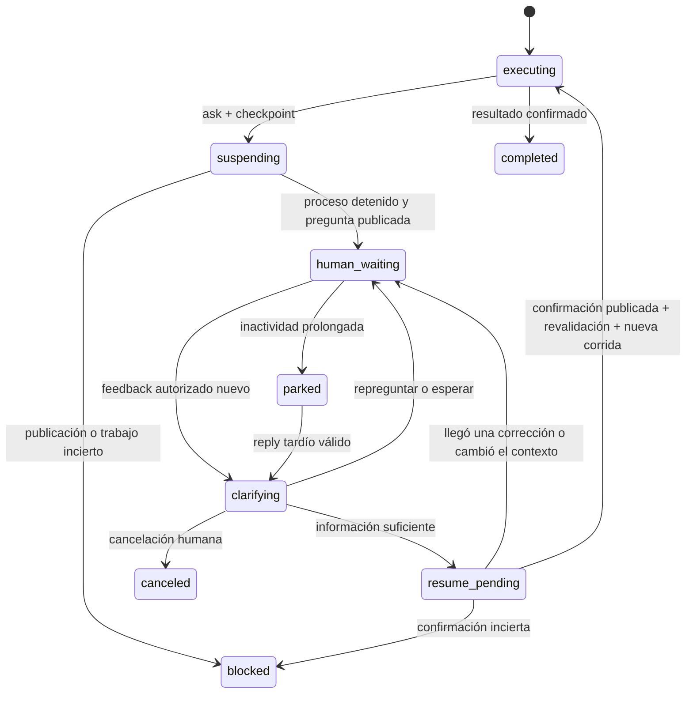

# Consultas humanas durante una automatización

**Estado: diseño para implementar, 2026-09-06. No disponible en 0.10.1.**
Base revisada: `main`, commit `5c401e2`, y el servicio externo de drafts descrito
en la [guía de continuidad](automation-handoff.md). Este documento define el
comportamiento, los contratos, la migración y la prueba; no activa automatizaciones.
Los comandos y campos nuevos que aparecen abajo son propuestas, no comandos actuales.

## Resultado buscado

Una automatización puede detenerse cuando necesita información o una decisión
humana, publicar la consulta en el mismo bot y grupo que los drafts, conversar
por replies hasta resolverla, confirmar qué entendió y continuar el trabajo
guardado. Funciona tanto si la respuesta final a WhatsApp es directa como si
requiere un draft aprobado. El canal es reemplazable mediante un adaptador.

El humano no necesita un ID, botones ni una palabra exacta. La IA interpreta
texto y audio transcrito en contexto. Puede preguntar de nuevo tantas veces como
haga falta; no se usa el límite de cinco versiones de los drafts para cortar
una consulta. Mientras espera, ningún modelo queda ejecutándose.

## Experiencia de la persona

Ejemplo ficticio de una automatización técnica:

> 💬 **Consulta · Soporte de plataforma**
>
> • Responsable: Equipo de soporte
> • Trabajo: corregir el cálculo del reporte
>
> Encontré que el reporte incluye operaciones anuladas. ¿Querés excluirlas
> del total o mostrarlas por separado? Todavía no cambié el cálculo.
>
> Respondé a este mensaje; guardé el avance y espero tu respuesta.

El humano responde: «Mostralas aparte». La IA puede seguir:

> Entendido. ¿También las saco del total general, o sólo querés diferenciarlas
> visualmente?

El humano responde: «Sacalas del total y dejalas en una sección aparte». Antes
de retomar, el bot publica:

> ✅ Entendido: las anuladas van en una sección aparte y no suman al total.
> Ahora retomo el cambio y verifico el resultado. La respuesta al cliente seguirá
> pasando por revisión.

La última frase depende de la política real de salida; con respuesta directa no
se promete revisión. La confirmación no exige otro «sí» si la decisión ya está
clara. Cuando haga falta una aprobación explícita de una acción sensible, se
pregunta por esa acción concreta antes de continuar.

Cada mensaje de la IA responde dentro de la misma conversación de consulta.
Se puede responder a la pregunta inicial, una repregunta o una respuesta humana
encadenada; todo se vincula al mismo trabajo. Los mensajes sueltos del grupo
no se asignan por proximidad o por el nombre de una persona.

## Tres decisiones independientes

| Mecanismo | Pregunta que resuelve | Resultado |
| --- | --- | --- |
| Juez de atención, existente | ¿Este pedido lo atiende la IA, un humano o nadie? | Decide si iniciar trabajo. |
| Consulta humana, nueva | ¿Qué dato, criterio o decisión falta para continuar este trabajo? | Conversa y produce una continuación contextualizada. |
| Revisión de draft, existente | ¿Se puede enviar este texto exacto a este destinatario? | Aprueba, corrige, cancela o espera esa propuesta. |

Una respuesta en una consulta nunca cuenta por sí sola como aprobación de un
draft. Tampoco concede acceso a otros chats, credenciales o proyectos. El
operador configura por regla quién puede aportar decisiones y qué alcance
pueden tener. La IA puede pedir una ampliación de permisos; esa ampliación se
aplica mediante configuración operativa explícita, no ejecutando texto de Telegram.

## Qué se reutiliza y qué falta

Hoy existen publicación idempotente, respuestas con identidad y cursor, lectura
de ediciones, agrupación, perfiles de IA, permisos de corrida y estado durable.
El servicio externo ya recibe replies a mensajes del bot y respuestas encadenadas.

Faltan un diálogo de consulta con identidad estable, mensajes sucesivos del bot
vinculados a ese diálogo, checkpoint de trabajo y reanudación protegida. El
comando actual `automation result needs_human` registra una necesidad; no crea
esta conversación ni retoma trabajo mediante replies. `waiting` programa otra
ejecución por tiempo; tampoco implementa la espera humana descrita aquí.

No basta con reutilizar `draft revise`: en 0.10.1 cada versión es otra propuesta
con su cursor y aprobación de texto. La consulta necesita conservar todo el
intercambio, admitir respuestas a preguntas anteriores y continuar una tarea,
sin generar un envío de WhatsApp como efecto de esa decisión.

## Ciclo de ejecución



Una pausa explícita del operador suspende el despacho en cualquier estado y
conserva el historial. `parked` significa espera por inactividad y admite reply
tardío; **no equivale a una regla pausada manualmente**. Los errores inciertos
no se resuelven suponiendo que pasó suficiente tiempo.

### Suspender en un punto seguro

1. El ejecutor registra la pregunta, el motivo y un checkpoint. La operación
   persiste atómicamente la intención de suspensión y la clave de publicación.
2. Desde ese momento su permiso del bridge no acepta nuevas acciones externas.
   El modelo termina; el supervisor confirma el cierre del árbol de procesos.
   No se mantiene una terminal o llamada al modelo durante horas esperando.
3. Se reserva el trabajo/workspace sin ocupar un cupo de IA y se publica la
   pregunta. Sólo entonces se puede decir «guardé el avance y estoy esperando».
4. Si un despliegue, envío u otra acción está en curso o su resultado es
   desconocido, primero se registra la incertidumbre. Un checkpoint narrativo
   no transforma una operación incierta en una suspensión segura.

El checkpoint contiene objetivo, hechos comprobados, pregunta pendiente, pasos
hechos y pendientes, referencias a artefactos, versiones de contexto, siguiente
paso previsto y operaciones externas con evidencia de su resultado. Para código:
worktree, HEAD, inventario/huellas del diff y estado de procesos. No es necesario
commitear trabajo incompleto, pero debe quedar aislado y verificable.

La reanudación es una **nueva corrida del proveedor con ese contexto**. No depende
de conservar una sesión interna de Codex/Claude ni de volver a ejecutar el prompt
original desde cero. Se verifica el checkpoint antes de modificar o enviar algo.

### Interpretar cada reply

El daemon persiste eventos y cursor de recepción, agrupa una ráfaga breve y
ejecuta una etapa `clarify`. Usa el perfil de consulta configurado, sin permiso
de envío a WhatsApp ni de modificar el workspace. Recibe checkpoint, preguntas,
respuestas vigentes, decisiones anteriores y novedades relevantes del origen.

La disponibilidad de Telegram y del perfil de consulta se evalúa por separado
de la conexión WhatsApp. Se puede aclarar una duda con WhatsApp desconectado
usando el último contexto, marcado como desactualizado; continuar efectos o
enviar requiere recuperar cobertura fresca. Esto exige separar la etapa
`clarify` del gate global de conexión que hoy tiene el worker.

Esa etapa emite una herramienta con una de cuatro acciones:

- `ask`: explicar lo entendido y hacer otra pregunta concreta.
- `wait`: aún no hay una decisión suficiente; indicar qué falta sin repetir
  mensajes idénticos ni volver a invocar al modelo con el mismo feedback.
- `continue`: registrar respuesta estructurada, resumen y confirmación visible
  de qué hará al retomar. El motor hace las comprobaciones y reanuda.
- `cancel`: cancelar el trabajo dependiente, conservar evidencia y comunicarlo.

Una consulta puede resolver dudas sucesivas. Si durante la continuación aparece
otra duda, el ejecutor abre una nueva ronda vinculada al mismo trabajo. No se
exige que toda la tarea se resuelva en una sola respuesta humana.

### Confirmar antes de continuar

`continue` registra en una transacción la decisión, el cursor leído, la versión
del contexto y un mensaje de confirmación en el outbox del canal. El trabajo
queda `resume_pending`; no se inicia todavía el ejecutor.

La confirmación se publica con una clave estable. Tras aceptación del canal,
se vuelven a drenar novedades del diálogo y del chat fuente. Se comprueban:
regla activa, autoridad vigente, contexto y checkpoint actuales, ausencia de
efectos inciertos, reserva de workspace y decisión sobre el último feedback.
Sólo entonces se crea una continuación identificada de forma única y se emite
un nuevo permiso de corrida. Telegram confirmó publicación, no lectura humana.

Si la publicación queda ambigua, no se repite con otra clave ni se continúa en
silencio: se inspecciona la operación. Si llega una corrección antes de retomar,
se invalida la decisión y se vuelve a interpretar. No existe una transacción
atómica entre Telegram, WhatsApp y el proceso del agente; la garantía termina
en los eventos observados y las comprobaciones antes de cada efecto. Un mensaje
que llegue después no permite retirar una operación externa ya iniciada.

## Trabajo estable y novedades del cliente

Separar `workId` (trabajo de principio a fin) de `batchId` (lote de mensajes),
`runId` (intento del proveedor), `dialogueId` (consulta) y `draftId` (propuesta de
salida). Una consulta o continuación siempre apunta al mismo `workId`.

Mientras espera una consulta, los nuevos mensajes del origen se acumulan en
ese trabajo, incrementan `sourceEpoch` e invalidan decisiones/salidas preparadas.
No se inicia otro ejecutor que repita el trabajo ni se descarta automáticamente
la consulta. El intérprete debe considerar las novedades antes de continuar.
Si el pedido cambió sustancialmente, la IA lo explica y solicita aclaración.
Separar pedidos independientes requiere una decisión explícita posterior; no se
divide trabajo por palabras clave mientras exista una consulta bloqueante.

Esto exige cambiar el comportamiento actual de `enqueue`, que marca esperas y
drafts anteriores como `superseded` al llegar mensajes. La nueva excepción es
para el **trabajo suspendido por consulta**; la protección existente de drafts
obsoletos debe mantenerse. Conservar también `humanTakeover` de la regla:
un mensaje propio puede imponer control humano y ningún reply lo libera solo.

La reserva de chat/workspace impide otro ejecutor sobre recursos solapados,
pero no ocupa el límite de tres modelos. Otras conversaciones continúan. Para
varios trabajos técnicos, usar worktrees aislados; una reserva en el motor no
impide que un proceso ajeno modifique archivos. Al retomar, comparar estado real
con el checkpoint y bloquear si cambió sin reconciliar.

## Estado durable y concurrencia

Para múltiples automatizaciones y conversaciones largas, la implementación
propuesta usa **SQLite dedicado a automatizaciones**, separado del mirror:
`data/automation.sqlite`. Migrar reglas/lotes/outbox del JSON actual a un único
almacenamiento transaccional permite guardar feedback, decisiones, publicación
y continuación sin una doble escritura independiente entre archivos de control.
No aplicar al diálogo pendiente la purga de siete días del mirror.

| Entidad | Contenido mínimo |
| --- | --- |
| `rules`, `batches`, `outbound` | Datos existentes, IDs e historia conservados. |
| `works` | Regla, lotes vinculados, estado, recurso reservado, `controlEpoch`, `sourceEpoch`, checkpoint vigente. |
| `dialogues` | Trabajo, política fijada, estado, referencia de canal, `receivedCursor`, `processedCursor`, último avance humano. |
| `dialogue_events` | Evento original, cursor, identidad, mensaje/respondido, texto/edición/audio, publicación propia; deduplicación por proveedor y diálogo. |
| `checkpoints` | Versiones inmutables de contexto, artefactos y pasos/evidencia. |
| `dialogue_decisions` | Acción, evidencias, cursor y epochs usados, resumen y plan de continuación. |
| `channel_outbox` | Publicación/confirmación/cierre, clave estable, hash del payload y aceptación/incertidumbre. |
| `continuations` | Una entrada por decisión válida, checkpoint, claim, nuevo `runId` y resultado. |

Decisión y claim de continuación usan compare-and-swap sobre cursor, epochs y
estado; índices únicos impiden duplicar una decisión o continuación al repetir
una llamada. Las llamadas de red y al modelo van **fuera** de transacciones.
Todos los escritores, incluidos los comandos de operador, usan el mismo store.
El perfil se fija con modelo, esfuerzo, huella de prompt y alcance en el trabajo;
un cambio incompatible de configuración requiere revalidación, no adopción silenciosa.

No se borra una respuesta por haberla leído. Primero se persiste; después se
registra qué cursor interpretó el modelo. Ediciones conservan historial y exponen
la última versión. La entrada al modelo es acotada: hechos/decisiones con sus
referencias, preguntas abiertas y mensajes recientes. El historial íntegro queda
paginado y consultable por herramientas; un resumen no sustituye la evidencia
literal de una autorización. Así no hay un límite artificial de rondas ni un
prompt que crezca sin control.

La migración es un paso de implementación, no una propiedad de 0.10.1: parar
escritores, backup consistente, importar v1/v2/v3, validar conteos/IDs/estados,
escribir marcador de versión mínima y pasar **todos** los lectores/escritores al
store nuevo. El JSON anterior queda como respaldo, no como segunda fuente de
verdad. Instalaciones antiguas no deben seguir escribiendo sobre ese respaldo;
la actualización y el rollback requieren controlar binarios y daemon activos.
No modificar `auth/`, perfiles privados ni sesión de WhatsApp durante la migración.

El store usa claves foráneas, transacciones de escritura breves, espera acotada
por locks y durabilidad configurada; pruebas de concurrencia con procesos reales
deben validar la implementación. Checkpoints y diálogos activos no vencen con el
mirror. Para trabajos cerrados, retención/exportación privada configurable y
tombstones de claves/continuaciones que impidan replay tras purgar contenido.
Backups SQLite consistentes y archivos privados, sin tokens en el transcript.

## Tiempo de espera y respuestas tardías

Decisión inicial propuesta:

- Sin cancelación automática por demorar una hora o un día; consultas sin plazo
  destructivo por defecto.
- Tras siete días **sin actividad humana autorizada**, marcar `parked`, conservar
  trabajo y aceptar replies tardíos. Antes de continuar, revalidar contexto.
- Sin recordatorios periódicos por defecto; avisos sólo ante pregunta, respuesta
  útil, confirmación, cierre o fallo que requiera intervención.
- Sin `maxRevisions` ni máximo fijo de rondas en consultas. Limitar tamaño por
  mensaje/página, concurrencia y reintentos técnicos; nunca interpretar un límite
  de recursos como aprobación o cancelar silenciosamente la tarea.

La lectura del canal sigue activa para detectar respuestas tardías. Puede reducir
frecuencia en diálogos inactivos. La espera no ocupa una llamada al proveedor.
Pausar explícitamente la regla detiene IA, publicaciones y continuación; se puede
seguir archivando feedback, pero volver a habilitar requiere acción del operador.
Una tarea cancelada no se reabre por un reply viejo: se registra el mensaje y,
si la regla permite avisos, se explica que la tarea está cerrada.

## Transporte genérico y mismo bot

Mantener el protocolo v1 de drafts compatible. Agregar un protocolo de diálogo
v2 negociado por capacidades: una regla de consulta no se activa si su adaptador
no anuncia soporte. No traducir una consulta a un draft como fallback silencioso.

Operaciones nuevas propuestas, con JSON por stdin/stdout y sin shell:

| Operación | Contrato |
| --- | --- |
| `status` | Salud y capacidades, por ejemplo `dialogues.v2`, `edits`, `audio`. |
| `open` | `key`, tipo `consultation`, contexto visible, pregunta; devuelve `dialogueId`, `messageId` y estado de publicación. |
| `post` | Diálogo, `key`, mensaje respondido y texto; tipo `question`, `acknowledgment` o `closure`. Igual clave/payload devuelve la misma publicación. |
| `events` | Diálogo y `after`; hasta 50 eventos ordenados, identidad estable y `nextCursor`, sin consumir eventos de otros callers. |
| `inspect` | Buscar publicación por clave, hash y estado. Si la entrega es desconocida, informarlo; no inventar confirmación. |

El servicio asigna la asociación de mensajes al diálogo; no confía en un ID
escrito por un humano dentro del texto. Registra `(canal, chat, messageId)` para
la pregunta raíz y **cada** respuesta del bot, además de replies humanos
encadenados. Las ediciones tienen un nuevo evento y conservan el mismo mensaje.
Respuestas a una pregunta anterior de una consulta abierta sí pertenecen a su
contexto; su pertinencia la interpreta la IA. Los drafts conservan la exigencia
distinta de aprobar la versión actual.

Por ahora, extender el servicio y CLI Maspeak existentes con esos comandos bajo
un dominio `dialogue`, conservando el mismo bot, grupo y consumidor único de
`getUpdates`. Las consultas usan encabezado «💬 Consulta» y las propuestas
«📝 Borrador». El bot no interpreta intención ni ejecuta trabajo; sólo transporta
y persiste. Su `open/post` confirma publicación, no resolución de la consulta.

WhatsApp sigue entrando por eventos Baileys. Telegram sigue usando el long polling
del servicio y el daemon consulta eventos persistidos cada cinco segundos; agrupa
replies durante cinco segundos, con máximo de veinte antes de interpretar.
Un webhook futuro sólo adelantaría el despertar: el cursor durable sigue siendo
la fuente de verdad y se mantiene reconciliación después de una caída.

## Herramientas y configuración propuestas

**Estos comandos todavía no existen.** La interfaz debe implementarse y probarse
antes de usarlos en una regla real.

```sh
# Ejecutor: guardar avance, preguntar y terminar esta corrida.
wa automation human ask --question "¿Qué criterio aplico?" \
  --reason "El pedido admite dos interpretaciones" \
  --checkpoint-file /ruta/privada/checkpoint.json

# Etapa clarify: consultar contexto y registrar UNA decisión.
wa automation human context
wa automation human decide ask --cursor 12 --reply 12 \
  --text "Entendido. ¿También lo excluyo del total?"
# Alternativa cuando hay información suficiente:
wa automation human decide continue --cursor 13 --reply 13 \
  --summary "Excluir anuladas del total y mostrarlas aparte" \
  --ack "Entendido; retomo el cambio con ese criterio y verifico el resultado."

# Operador: bandeja transversal y expediente de una consulta.
wa automation human list --pending --verbose
wa automation human show CONSULTA --json
```

El servidor obtiene `workId`, `runId`, checkpoint y epochs del permiso vigente;
no permite elegir otro trabajo ni autorizarse con `--cursor` inventado. El archivo
de checkpoint tiene esquema y tamaño acotados, no contiene secretos y se copia
al store como registro inmutable. Un `ask` confirmado cambia el estado: ya no
acepta `result resolved`, envío directo ni una segunda acción del mismo ejecutor.

La política `humanConsultation` es opt-in e independiente de `review`:

```json
{
  "version": 1,
  "adapter": {"command": ["/ruta/absoluta/adaptador-dialogos"]},
  "profile": "interpreter",
  "responders": ["canal:identidad-estable"],
  "actor": "Equipo responsable",
  "instructions": "Aclarar criterio dentro del alcance asignado; ante contradicciones, preguntar.",
  "pollSeconds": 5,
  "replyDebounceSeconds": 5,
  "replyMaxWaitSeconds": 20,
  "idleAfterSeconds": 604800,
  "idleAction": "park",
  "maxTurns": null,
  "ackBeforeResume": true
}
```

La bandeja muestra automatización, tarea, modelo del ejecutor/intérprete, pregunta
abierta, estado, espera, último feedback, salud de publicación y siguiente paso.
Con el mismo bot pueden coexistir drafts y consultas; cada fila identifica su
tipo. Los IDs quedan en inspección técnica, fuera del mensaje cotidiano.

El servicio vincula cada diálogo al principal autenticado que lo abrió y valida
su acceso a `post/events/inspect`; un ID conocido no da acceso a otro consumidor.
La autoridad humana se verifica por ID del remitente del evento, no por nombre
visible, texto reenviado, firma o una identidad mencionada dentro del audio.

## Fallos, autoridad y límites concretos

| Situación | Comportamiento exigido |
| --- | --- |
| Usuario demora un día o más | Persistir y aceptar reply; revalidar antes de continuar. |
| Reinicio esperando | Recuperar checkpoint, publicaciones y cursor; no repetir trabajo ni pregunta. |
| Crash después de decidir o publicar confirmación | Reconciliar outbox/continuación por clave; claim único. Si hay ambigüedad, bloquear. |
| Proveedor falla interpretando feedback | Mantener cursor pendiente. Reintentos acotados con backoff, luego bloqueo visible; no repreguntar por un dato ya recibido. |
| Proveedor queda sin cuota | Aviso factual del runtime con diagnóstico redactado. La respuesta humana no arregla por sí sola el proveedor; esperar recuperación antes de interpretar. |
| Respuestas contradictorias o «sí, pero…» | Leer todas las opiniones vigentes autorizadas y preguntar por lo que siga sin resolver. |
| Reply no autorizado, bot o canal anónimo | Registrar auditoría sin invocar modelo ni conceder permisos. |
| Audio sin transcripción o adjunto no comprendido | Explicitar qué no se pudo interpretar y solicitar alternativa; nunca asumir contenido. |
| Feedback durante decisión/confirmación | Incrementar generación e invalidar continuación preparada; interpretar novedades antes de ejecutar. |
| Feedback tras reanudar | Vincular al trabajo original; revocar acciones dependientes aún no iniciadas y revisar la corrección en el siguiente punto seguro. Efectos ya iniciados requieren reconciliación. |
| Pause/cancel/remove | Cortar despachos y permisos; conservar checkpoint y auditoría. Una cancelación no revierte efectos realizados. |
| Mensaje borrado en Telegram | No prometer detección: retirar una decisión mediante reply o edición explícita antes de la acción. |
| Se cae el canal | Conservar estado; reintentar sólo fallos confirmados sin publicación. Una publicación incierta no se reenvía a ciegas. |

No se obliga al humano a aprobar cada paso rutinario: la consulta aparece por
información necesaria, conflicto de criterio o imposibilidad comprobada. No
despertar al modelo por sus propios mensajes ni repetir una decisión con el mismo
cursor. Distinguir errores de transporte de nuevas dudas semánticas.

Los permisos del bridge protegen WhatsApp, no todo el sistema operativo. Para
trabajo técnico, la robustez también exige proceso supervisado, workspace aislado
y puntos seguros entre efectos. Un «lo intenté» del modelo no prueba el resultado
de un deploy, una escritura externa o un envío. Si no se puede demostrar un punto
seguro, registrar `uncertain` y consultar desde ese estado sin prometer reanudación
automática. Sólo una revisión factual puede reconciliar esos efectos.

## Plan de implementación y archivos

| Paso | Cambio concreto | Criterio de cierre |
| --- | --- | --- |
| 1. Store y migración | Introducir store transaccional para reglas, lotes, trabajo, checkpoint, diálogo, decisiones, outboxes y continuaciones; adaptar [prompt-automation-rules.js](../src/prompt-automation-rules.js) conservando su API donde sea posible. | Importación v1/v2/v3 conserva IDs/pausas; interrupción de migración no habilita dos escritores ni pierde cola. |
| 2. Canal de diálogo | Extender `ops/drafts/service.py`, `client.py` y `scripts/cli/drafts.ts` del repo privado; añadir adaptador público de diálogo junto al [adaptador de drafts](../src/review-adapters/maspeak-drafts.js). | Mismo bot; root/follow-ups/replies/ediciones se asocian; idempotencia y v1 intactas; capacidades comprobables. |
| 3. Suspensión | Implementar `human ask`, checkpoint y herramienta de contexto en [bin/wa.js](../bin/wa.js), [server.js](../src/server.js), [automation-capabilities.js](../src/automation-capabilities.js) y [automation-worker.js](../src/automation-worker.js). | La pregunta no se publica como espera segura hasta terminar la corrida; se retiran permisos y se libera el cupo IA. |
| 4. Conversación y continuación | Coordinador `human-consultations.js`, etapa `clarify`, contexto del proveedor, decisiones, confirmación y reanudación con claim único. | Varios intercambios; confirmación aceptada antes de retomar; nuevos mensajes o feedback invalidan decisiones viejas. |
| 5. Operación | Bandeja de pendientes, inspección, cancelación, diagnóstico, retención/paginación y salud. | Identificar por qué espera cada tarea sin leer SQLite a mano; persistencia y bloqueo comprensibles. |
| 6. UAT y entrega | Migración con backup, actualización del servicio antes del cliente, consultas opt-in y piloto expresamente acordado. | Evidencia real de los casos de abajo y pausa al cerrar; documentación de versión instalada. |

Las reglas actuales conservan `humanConsultation: null`; el despliegue no las
activa ni cambia su política de drafts. Implementar consulta desde la etapa de
ejecución primero; convertir el juez en otro participante que conversa no es
necesario para este flujo y requeriría su contrato de continuación propio.

## Pruebas que habilitan producción

Pruebas automatizadas nuevas y regresiones de los actuales
[drafts](../test/automation-reviews.test.js),
[reglas](../test/prompt-automation-rules.test.js),
[worker](../test/autonomous-conversations.test.js) y
[permisos](../test/automation-capabilities.test.js):

1. Dos o más preguntas, feedback agrupado, respuesta a la raíz y a follow-ups,
   edición/contradicción y audio: se conserva contexto y no hay autoaprobación.
2. Misma respuesta recibida dos veces: una decisión; mismo continue dos veces:
   una confirmación y una continuación; mensajes del bot no forman un bucle.
3. Fallo inyectado antes/después de cada persistencia, publicación y claim:
   reconstruir sin efectos duplicados y bloquear si el resultado es desconocido.
4. Corrida antigua, cursor inventado, identidad no autorizada o reply a otro
   diálogo: ninguna escritura/envío/continuación autorizada.
5. Novedades de WhatsApp, pausa y feedback tardío en cada fase: preservar el
   trabajo y rechazar salidas obsoletas; workspace solapado no se ejecuta en paralelo.
6. Espera simulada de uno, siete y más días; diálogo largo paginado; caída de
   proveedor/canal; ninguna cancelación por inactividad ni modelo ocupado esperando.
7. Consulta con salida directa y con draft: el primer caso respeta permisos
   originales; el segundo exige aprobación separada del texto final exacto.
8. Migración, rollback controlado y backups consistentes con eventos en espera.

Piloto humano posterior: tarea técnica inocua en workspace aislado, duda inicial,
reply parcial, repregunta, reply suficiente, confirmación visible y continuación
con resultado verificable. Repetir con draft final y salida directa autorizada;
probar cancelación, reinicio esperando y respuesta al día siguiente. La prueba
anterior del chat directo valida drafts, **no valida esta nueva capacidad**.
