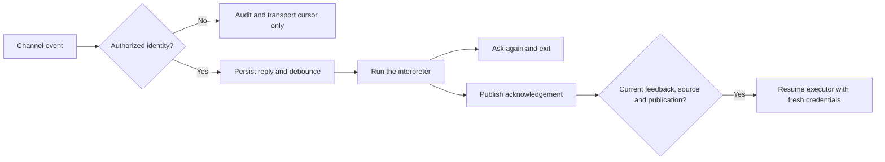
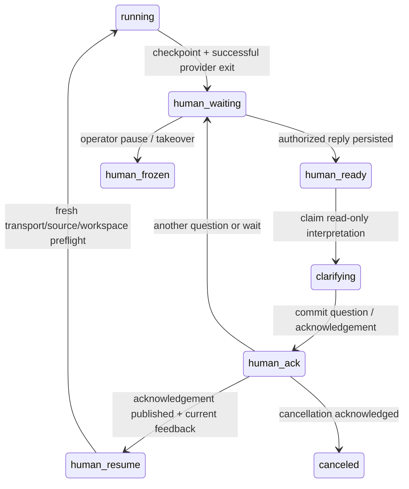

# Durable human consultation (0.11)

An executor can ask a human for missing information, stop, and continue later.
The same channel can carry another question, a human answer and an acknowledgement
for as many rounds as necessary. This works with or without outbound draft review.
Consultation answers never approve WhatsApp drafts or change the configured scope.

## Runtime and native providers

The bridge owns the work, permissions, journal and continuation. The CLI process
is closed during the human wait. A small transport poll runs every five seconds
by default; it does not invoke a model. Telegram's single receiver uses long
polling and persists replies before advancing its offset. Do not attach another
Telegram plugin/receiver to that bot: consumers compete for updates.

- **Codex CLI:** persistent `exec --json`, followed by `exec ... resume <UUID> -`.
  The worker takes the ID from `thread.started`. It never uses `--last` or
  `--ephemeral` for consultation-enabled execution. The scoped CLI command
  `wa automation human ask` records the checkpoint; the process then exits.
- **Claude Code CLI:** persistent `-p --output-format json`, an owned
  `PreToolUse` hook and `permissionDecision: defer` for `AskUserQuestion`.
  The worker requires a matching hook receipt and a `tool_deferred` result.
  A minimal stdio MCP permission handler makes the native question available
  headlessly; it denies unconfigured permission requests. On resume, the hook
  answers only the saved tool ID with the engine's current human decision.
  `--restricted`, empty setting sources, explicit settings and strict MCP
  configuration isolate the integration from user plugins. `--safe-mode`
  would disable the hook, so it is used only by other stages.
- Both providers also support the explicit `human ask` command. The clarification
  interpreter uses a separate, disposable process without a code workspace or
  WhatsApp write permissions. Its bounded summary carries earlier rounds.
- Native executor context is supplemental evidence. Every run gets a fresh
  capability, current policy, current source and checkpoint. Temporary credentials
  are revoked and removed after the run. A resumed ID cannot switch provider,
  configured model, approved prompt or workspace silently. A resumed result must
  return the exact saved session ID; a different ID is a failure, never a new
  continuation. Use a full versioned model ID in profiles when model-version
  stability is required: provider aliases such as `opus` may change upstream.

Validated with **Codex 0.153.4** and **Claude Code 2.1.263** on 2026-09-06.
Do not infer compatibility of older versions from ordinary `agents doctor`:
use the real, neutral test below after installing/upgrading a provider. Unsupported
flags/results fail closed. No App Server connection, GUI, tmux session, Telegram
Claude plugin or direct model API key is required by this integration.

### Waiting and model usage

Waiting is deterministic. The executor has exited; the persisted work and a
transport poll remain. A minute or a week of waiting does not, by itself, consume
model tokens. The interpreter runs only for authorized feedback (or to reconsider
that feedback when source facts change); the executor starts again only after the
current acknowledgement and continuation checks pass. Reading retained context,
interpreting a reply, drafting another question and continuing work do use tokens.
Ordinary server/adapter resource usage continues while polling.

The transport cursor includes every received event; the interpretation cursor
advances only for authorized replies. Ignored events stay in the journal for
operator inspection without waking a model, invalidating a valid decision or
entering the interpreter's new feedback. Existing schema-4 state is accepted:
a missing transport cursor defaults to the previous cursor on first use.



Publication responses and inspection results must preserve the original dialogue
ID. An in-flight or ambiguous publication blocks both interpretation and continuation
until inspection confirms the original result. It cannot be replaced merely because
a source message arrived.

Claude native defer has a single-tool-call constraint. A hook receipt without the
expected deferred result is a failure, including an ignored parallel defer. The
worker stops remaining descendants in its process group and does not resume
uncertain work automatically. Process-group checks and CLI restrictions are not
an OS security boundary: run untrusted code work under a dedicated account/container.
The existing Codex code executor uses `danger-full-access` to reach the local
bridge, whose server still enforces WhatsApp scope on every request.

## State transitions and guarantees



The original batch ID is the stable work ID; each process has a different run ID.
New source messages while waiting append to the same work and advance its source
epoch. Source facts are journaled separately from the seven-day WhatsApp mirror.
New source events or Telegram edits invalidate stale interpretations and pending
continuations. Pagination must be read contiguously before a decision is accepted.
Only explicit responder identities can wake interpretation or authorize continuing;
bot/sender-chat identities cannot. Untranscribed audio cannot authorize continuation.

The acknowledgement is committed as an outbox intent and must be confirmed by the
adapter before execution can resume. The worker checks for newer channel events
again just before launching the executor. This defines a continuation boundary;
a message arriving after work has started does not undo an in-flight side effect.
Use operator pause/cancel to stop an active run and inspect partial work.

Idle consultations are **parked, not canceled**, after seven days by default.
Later replies still work. Parking is an operational label and retains the small
transport poll. An explicit operator pause freezes work: a later Telegram reply
cannot reactivate it. Model slots are free while waiting; the chat and any code
workspace remain reserved. Separate isolated Git checkouts allow unrelated work.
Workspace checks hash HEAD, tracked and staged diffs, and untracked content. Drift produces a
new consultation before another executor runs. If a native question is still
deferred, this pre-launch consultation preserves it and requires complete answers
again before resumption. A later question from the executor starts fresh instead.
Ignored files, external systems and
detached processes outside the process group are outside that fingerprint.

The [0.11.1 review record](reviews/2026-09-06-consultation-hardening.md) separates
locally verified corrections from the requested Fable review, which ended at the
provider's session limit without a review report.

## Persistence and upgrades

State schema 4 uses `data/prompt-automations.json.sqlite3` (WAL, synchronous FULL).
The `control` table stores rules, batches and outbound records. `journal` stores
immutable source events, replies, checkpoints, provider sessions, decisions and
channel publications. A single SQL transaction commits a control change and its
journal entries. The existing process-owned file lock serializes CLI/daemon writers;
no SQL transaction is held across provider/adapter network I/O.

The first write migrates v1/v2/v3 JSON, preserving rules, pauses, reviews and history.
It saves `prompt-automations.json.pre-sqlite` and replaces the original file with a
schema-4 storage marker. Older binaries reject that marker. **Stop the old daemon
before deploying. Do not downgrade against the migrated state.** For rollback,
restore a coherent pre-upgrade backup, including any external channel state; do
not blindly replay messages sent since that backup.

Control/journal files are private and are not automatically pruned for consultation
work. Native work directories live under `data/automation-workers/<work-id>/execute`.
Claude session retention is set to 365 days for these runs; Codex/Claude transcripts
remain in their provider's user state. Back up the automation database using SQLite's
backup API, private policy/prompts, worktrees, provider state and the channel queue.
Do not copy only a live SQLite main file while ignoring its WAL. Native transcripts
or authentication may be removed/expire independently: the engine will not pretend
it resumed a missing session. Inspect the durable checkpoint before replacing work.

## Configure an existing rule

First create an ordinary provider profile for the **interpreter**, with a prompt
that explains how to resolve questions. It must have no workspace. A starting prompt
is [human-interpreter.md](prompts/human-interpreter.md).

Save a private policy, outside the public checkout:

```json
{
  "version": 1,
  "adapter": { "command": ["/absolute/node", "/installed/src/review-adapters/maspeak-drafts.js", "/private/adapter.json"] },
  "profile": "human-interpreter",
  "actor": "Automation owner",
  "responders": ["telegram:AUTHORIZED_USER_ID"],
  "instructions": "Ask for missing facts until the task is clear. Never expand its permissions.",
  "pollSeconds": 5,
  "replyDebounceSeconds": 5,
  "replyMaxWaitSeconds": 20,
  "idleAfterSeconds": 604800
}
```

```sh
wa automation human-policy check /private/human-policy.json
wa automation human-policy status /private/human-policy.json
wa automation human-policy set existing-rule /private/human-policy.json
```

Setting the policy does not activate a paused rule. Existing in-flight/frozen
consultations must be completed or canceled before changing their channel policy.
New rules accept `--human-policy /private/human-policy.json` alongside an independent
`--review-policy`. The optional Maspeak adapter is just one implementation: core
consultation code has no dependency on that CLI, service, bot or account.

## Agent tools and operator commands

```sh
# Executor: record a checkpoint, then exit immediately.
wa automation human ask --question "What is missing?" --reason "Why I need it" \
  --checkpoint "Completed actions, files changed, pending work and effects not to repeat"
# --checkpoint-file is an alternative to --checkpoint.

# Interpreter: read all pages, including retained source context.
wa automation human context
wa automation human context --after 50 --source-after 20
wa automation human decide ask --cursor 52 --reply reply-id \
  --text "A follow-up question" --summary "Updated factual summary of the dialogue"
# Other decisions: wait, continue, cancel. Continue text is the acknowledgement.
# Native Claude questions also require --answers-json mapping original question
# text to a human-grounded answer. This is not a tool permission grant.

# Operator: every listing is JSON; human list includes executor/interpreter models.
wa automation human list --pending
wa automation human show WORK_ID --after 0
wa automation prompt list --verbose
wa automation prompt pause RULE
wa automation human reconcile WORK_ID
wa automation human resume WORK_ID
wa automation prompt cancel WORK_ID --reason "Operator canceled the test"
```

`reconcile` reads the adapter's confirmed result by stable publication key. It does
not resend, activate the rule or resume work. Use it after an ambiguous client
response; if the adapter itself cannot prove publication, the work stays blocked.
`resume` explicitly releases a frozen consultation only after the rule is active,
human hold is released and publication uncertainty is resolved. Actual uncertain
workspace/WhatsApp effects require the existing factual review workflow.

## Reproducible headless test

```sh
# Real provider; simulated channel and human replies. No WhatsApp transport.
wa automation human test --profile YOUR_PROFILE --state-dir /private/test-codex

# Real provider + real human replies through the configured adapter.
wa automation human test --profile YOUR_PROFILE --state-dir /private/test-telegram \
  --policy /private/human-policy.json
```

The test overrides the task with a harmless example: choose a color, clarify its
shade, acknowledge and record `no_reply`. It does not use the profile's workspace
or customer messages. There is no WhatsApp socket or outbound endpoint in its
fixture bridge. For the real channel, reply to the first question with just a
color, then answer the shade question. The final local result reports `completed`
and zero WhatsApp sends. Use a separate directory per provider/test.

The real-channel test keeps durable state and can be stopped while waiting and
restarted with the same command/policy. For unattended VPS use, supervise that
command with systemd; ordinary configured rules already run inside the bridge's
systemd user service. The in-memory simulated channel is intended for a single
test process, not restart testing. GUI, browser and desktop automations are not
in the critical path.

## Adapter contract v2

An absolute argv array receives one JSON request on stdin and returns one JSON
response on stdout; no shell interpolation. Maximum response 1 MB, timeout 35s.
Errors stay in private diagnostics; credentials never enter the model prompt.

| Operation | Input | Required output |
| --- | --- | --- |
| `status` | `version: 2` | `capabilities: { dialogues: true, idempotentInspection: true }` plus optional health |
| `open` | `post: { key, text, reason, kind, actor, automation, target }` | `{ id, messageId, status: "published" }` |
| `post` | `dialogueId`, same `post` fields | Same root `id`, new message ID and publication status |
| `events` | `dialogueId`, `after` cursor | `{ replies: [...], nextCursor }`, up to 50, strictly ordered, no skipped cursor |
| `inspect` | Exact publication `key` | `{ key, id, messageId, status }`, or `{ status: "not_found" }`; never resend |

Each reply uses the v1 review event shape (`draftId` carries the stable dialogue ID):
`id`, `cursor`, `messageId`, `author: { id, isBot }`, optional `senderChat`, literal
`text`, `edited`, `audio` and optional `transcript`. Replies to any bot follow-up or
to other human replies must map to the same root. Edits create new cursor events.
The transport classifies neither intent nor approval. New keys distinguish posts;
repeating the same key/content must return its stored result without sending again.
`delivery_unknown` is never ordinary success. The existing v1 draft protocol remains
unchanged.

Test evidence and deployment status are recorded in [automation-handoff.md](automation-handoff.md).
The earlier [design](human-consultation-design.md) and [provider research](provider-consultation-research.md)
explain decisions; this document is the implemented runtime contract.

## Authentication and operational limits

Install and authenticate each CLI as the same non-root account that owns its
service. Authentication must already be usable headlessly; normal work and human
consultations never need a desktop or a browser session. CLI credentials and
native history belong to that provider and are distinct from the renewed, scoped
WhatsApp capability issued for every run.

This integration does not renew expired OAuth logins, purchase quota or convert
Telegram replies into native shell permission grants. Provider authentication,
quota failures, missing sessions or uncertain code effects stop the run for
operator diagnosis. A live model can ask about a denied action through `human ask`,
but an unavailable provider cannot generate a new question. Inspect `human list`,
`human show` and `agents doctor`; repair authentication on the owning host and
review any partial effects before explicitly replacing or resuming work.

The durable checkpoint remains inspectable if native transcripts disappear;
there is no automatic fresh-session fallback that could repeat completed work.
Waiting and journals survive process restarts, not loss of an unbacked-up disk.
Use the existing systemd service on Linux, enable user lingering and arrange
consistent private backups of both engine and channel state. Live provider UAT
on the intended VPS is still required after transferring authentication/paths.
